# Booking_Appointment
The Booking Management System efficiently handles appointment scheduling with two main modules: User and Admin. Users can register, log in, book appointments, and view them in the User Module. The Admin Module allows administrators to manage users, oversee appointments, and update details, ensuring seamless interaction and effective management.

Homepage:-
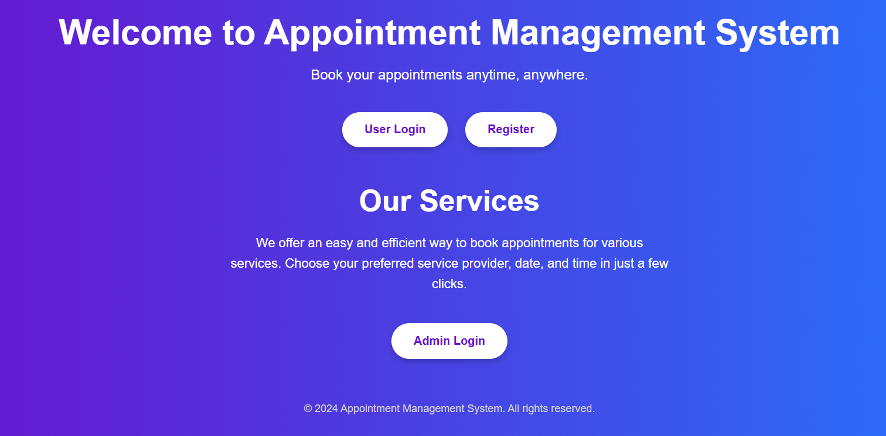

Registerpage:-
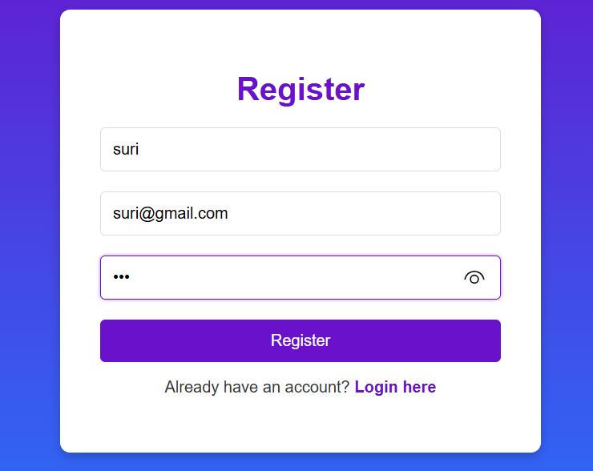

login.page:-
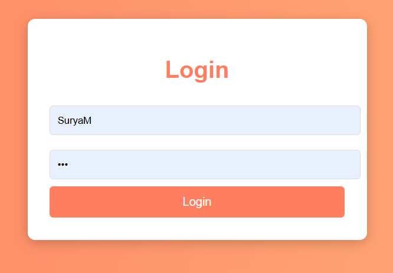

Booking:-
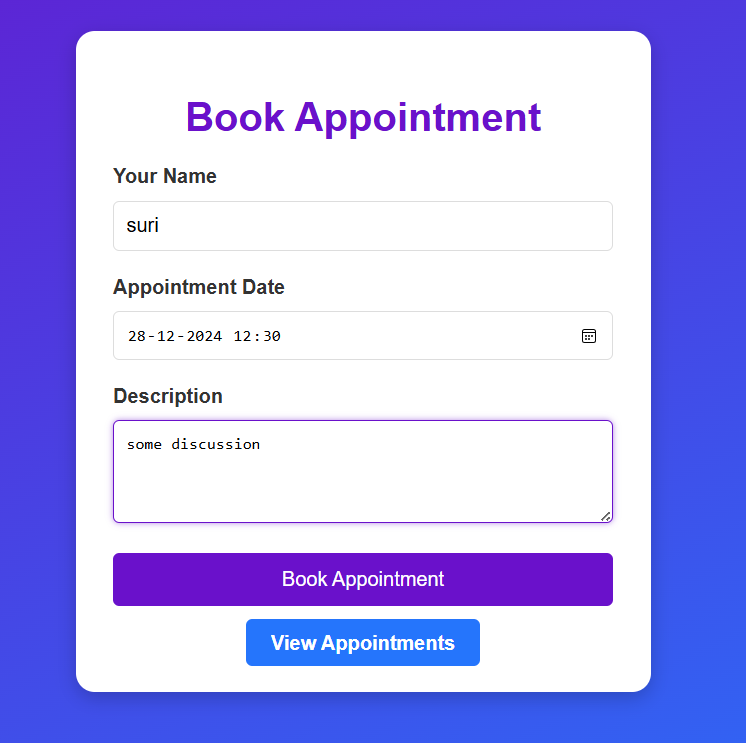

User_appointment:-

User_dashboard:-
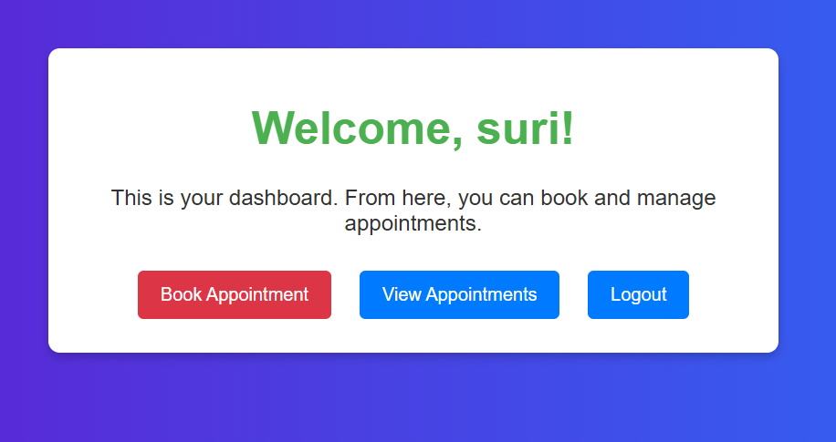

Adminlogin:-
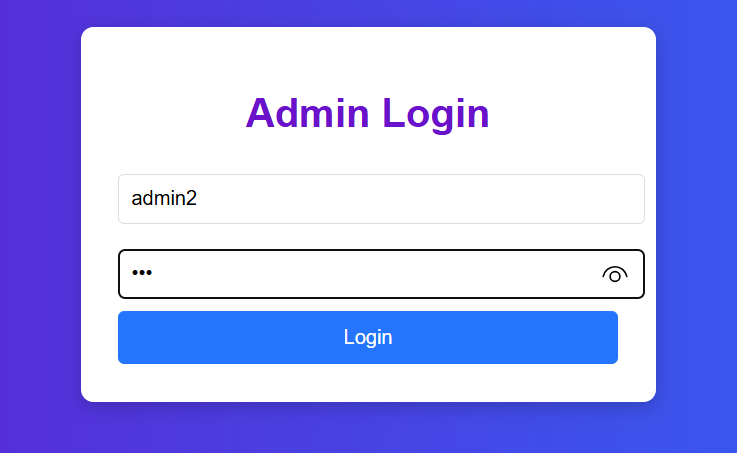

Admin_Dasboard:-
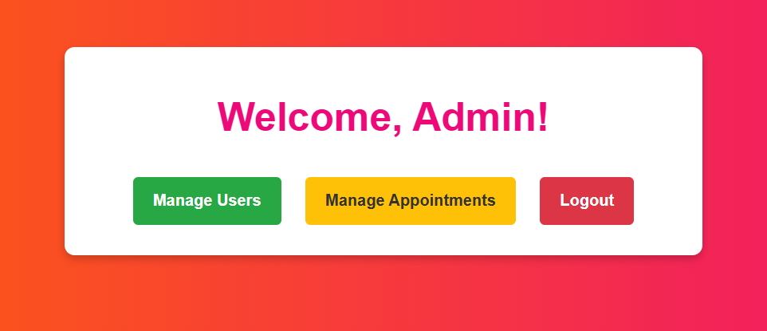

Admin_manage_in_users:-
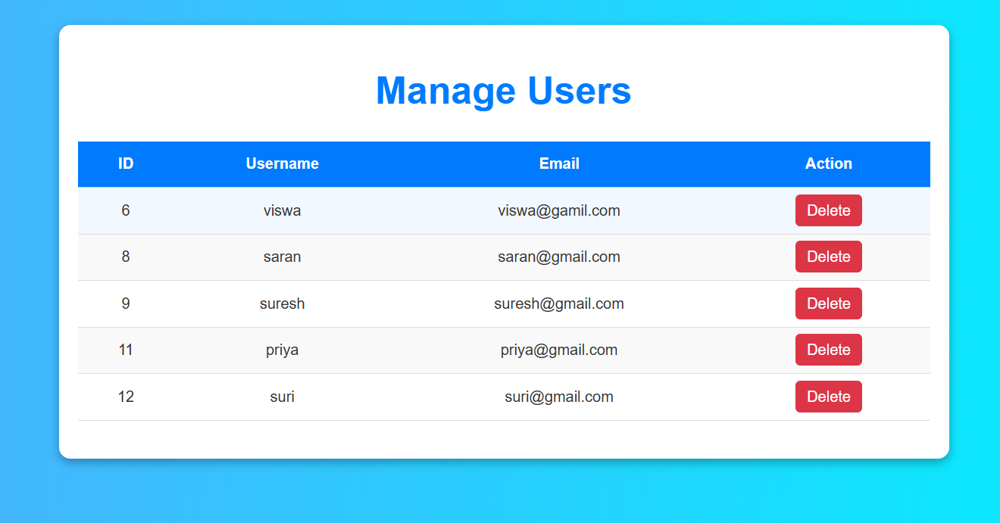

Admin_manage_appointment:-
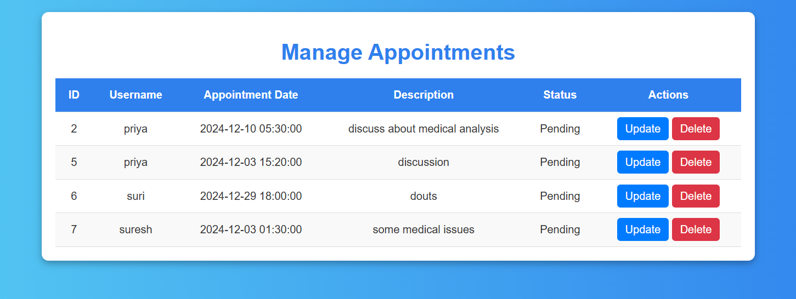

Admin_manage_appointment_Status:-
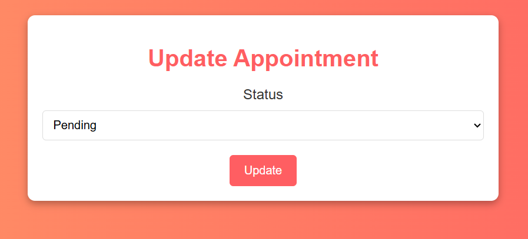

Database:-
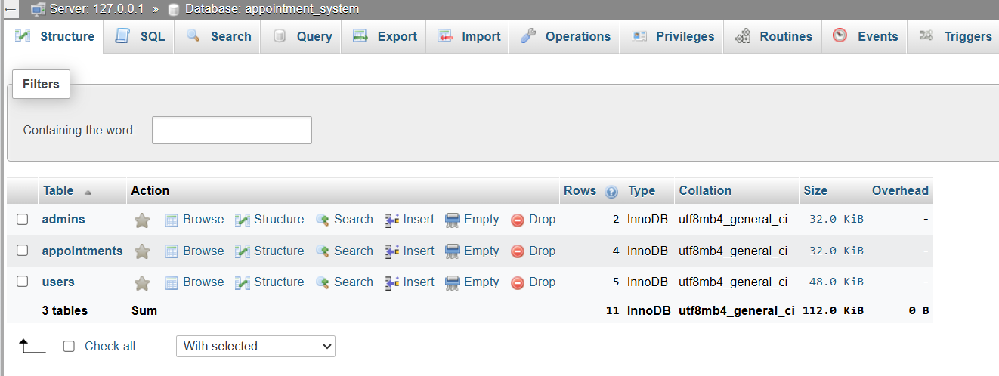

